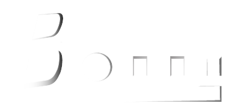

# Bonny
Bonny Official website is a cloned of Beyond Box, Guam website. The same design, responsiveness as well as styling. However, I have been able to tweak some of it to suits the purpose. (April 4, 2023)

I will continue to add my personal touch to it until achieve its own uniquness. (April 5, 2023)

Whatever changes I make in the css/main.css file, I will continue to update it here on the readme.md file as well. No copyright infringement intended, however, as an upcoming web developer, I want to try my ability to see how conversant I am with other people's code and how I can interpret them properly. To understand what code does what. It is worthy to note that, on the HOME PAGE, which I termed, "Who's That Girl?", I have been able to tweak the social media buttons using my own codes. 

HTML Code
					<li></li>
					<li></li>
					<li></li>

CSS Code

(April 6, 2023)

I tried tweaking the home page by adding contents to represent "Bonny Official" website. I did a redesign of the website logo using Adobe Illustrator.

I also added placeholder images for some "Feature Songs" content. This I will modify as time goes on. I also effected a media query within the HTML code and also with the help of CSS Bootstrap Framework attached to the original website. 

HTML Code
								

									I GUESS YOU WANNA KNOW THAT...
								

HTML Code
								

										
									
Cactus

								

(April 7, 2023)

I have been playing with GitHub and learning how to make my repositories more readable and understandable. This is the major reason I am making a diary of every change I make on the "Bonny Official" website. GitHub is my first hosting platform and it's also acting as my backup in case I need to revert to a previous version of what I have changed.